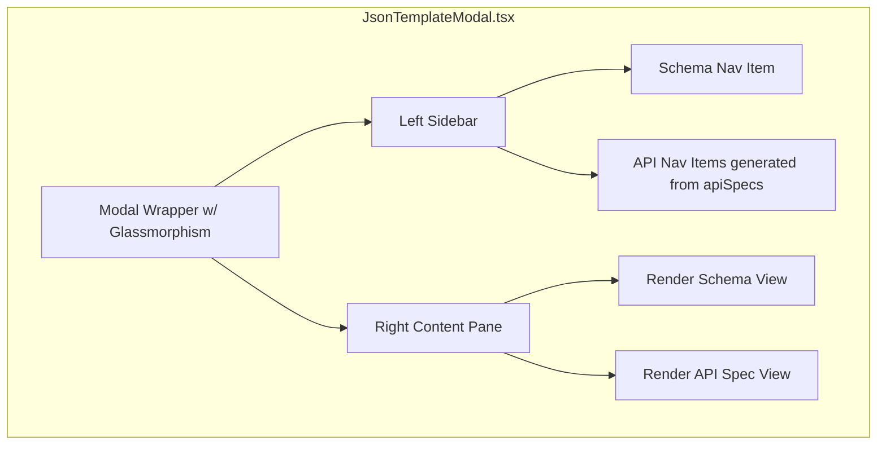

# Developer Documentation Hub Redesign Implementation Plan

> **For agentic workers:** REQUIRED SUB-SKILL: Use superpowers:subagent-driven-development to implement this plan task-by-task. Steps use checkbox (`- [ ]`) syntax for tracking.

**Goal:** Overhaul the `JsonTemplateModal.tsx` to use a modern, premium "Sidebar Navigation" layout with glassmorphism aesthetics instead of a simple top-tab layout.

**Architecture:** We will transition the modal from a stacked single-column layout with tabs to a two-pane flex layout. The left pane will serve as a sticky navigation sidebar displaying the schema and mapping over the `apiSpecs`. The right pane will render the selected item's content with smooth micro-animations.

**Architecture Diagram:**



**Tech Stack:** React, TailwindCSS, Lucide-react

---

### Task 1: Refactor UI Layout & State Management

**Files:**
- Modify: `src/components/JsonTemplateModal.tsx`

- [ ] **Step 1: Update state and data structures**
Add `id` to `apiSpecs` for easier rendering, and change the state variable.

```tsx
// Inside JsonTemplateModal component:
const [selectedItemId, setSelectedItemId] = useState<string>('schema');

// Add ids to apiSpecs mapping (or do it dynamically during render, but mapping is cleaner):
const apiSpecsWithIds = apiSpecs.map((spec, index) => ({
  ...spec,
  id: `api-${index}`
}));
```

- [ ] **Step 2: Update modal container structure**
Replace the top-level structure to support a two-pane flex layout. Remove the old Tab Buttons bar.

```tsx
// Change the wrapper div from flex-col to flex-row:
<div className="bg-[#fcfaf5]/80 dark:bg-[#1e1914]/80 backdrop-blur-xl border border-[#ebdcb9] dark:border-[#584a3b] w-full max-w-5xl rounded-3xl shadow-2xl relative z-10 overflow-hidden flex font-sans max-h-[85vh]">
  {/* Close button absolute top right */}
  <button
    type="button"
    onClick={onClose}
    className="absolute top-4 right-4 z-50 text-gray-400 dark:text-[#b8ab9f] hover:text-red-500 p-1.5 rounded-full hover:bg-white dark:hover:bg-[#292119]/60 transition-all cursor-pointer"
  >
    <X size={17} />
  </button>
  
  {/* Left Sidebar Pane will go here */}
  {/* Right Content Pane will go here */}
</div>
```

- [ ] **Step 3: Run typecheck to ensure no breakage**
Run: `npm run typecheck`
Expected: PASS

- [ ] **Step 4: Commit**
```bash
git add src/components/JsonTemplateModal.tsx
git commit -m "refactor: setup two-pane layout state for docs modal"
```

---

### Task 2: Implement Left Sidebar Navigation

**Files:**
- Modify: `src/components/JsonTemplateModal.tsx`

- [ ] **Step 1: Render the Left Sidebar**
Inside the flex container, add the sidebar width and items.

```tsx
{/* Left Sidebar */}
<div className="w-[280px] bg-white/50 dark:bg-black/20 border-r border-[#ebdcb9] dark:border-[#584a3b] flex flex-col overflow-y-auto scrollbar-thin">
  <div className="p-5 border-b border-[#ebdcb9]/50 dark:border-[#584a3b]/50">
    <div className="flex items-center gap-2">
      <FileCode size={18} className="text-[#bf8a50] dark:text-[#d6b56d]" />
      <h2 className="text-[11px] font-black text-[#5c493c] dark:text-[#f3eadf] tracking-widest uppercase">
        Dev Docs
      </h2>
    </div>
  </div>

  <div className="p-3 space-y-4">
    {/* Schema Group */}
    <div>
      <h3 className="px-3 mb-2 text-[10px] font-black text-[#9e8470] dark:text-[#8b7965] uppercase tracking-wider">Data Schema</h3>
      <button
        onClick={() => setSelectedItemId('schema')}
        className={`w-full text-left px-3 py-2 rounded-xl text-xs font-mono font-bold transition-all group ${
          selectedItemId === 'schema'
            ? 'bg-[#ebdcb9]/40 dark:bg-[#584a3b]/40 text-[#5c493c] dark:text-[#f3eadf] shadow-sm'
            : 'text-[#9e8470] dark:text-[#b8ab9f] hover:bg-white/40 dark:hover:bg-white/5'
        }`}
      >
        <span className="inline-block transition-transform duration-200 group-hover:translate-x-1">
          📄 Import Template
        </span>
      </button>
    </div>

    {/* REST API Group */}
    <div>
      <h3 className="px-3 mb-2 text-[10px] font-black text-[#9e8470] dark:text-[#8b7965] uppercase tracking-wider">REST Endpoints</h3>
      <div className="space-y-1">
        {apiSpecsWithIds.map((spec) => (
          <button
            key={spec.id}
            onClick={() => setSelectedItemId(spec.id)}
            className={`w-full flex items-center gap-2 text-left px-3 py-2 rounded-xl text-[11px] font-mono transition-all group ${
              selectedItemId === spec.id
                ? 'bg-[#ebdcb9]/40 dark:bg-[#584a3b]/40 shadow-sm'
                : 'hover:bg-white/40 dark:hover:bg-white/5'
            }`}
          >
            <span className={`px-1.5 py-0.5 rounded text-[9px] font-black ${
              spec.method === 'GET' ? 'bg-blue-100 text-blue-700 dark:bg-blue-900/40 dark:text-blue-400' :
              spec.method === 'POST' ? 'bg-emerald-100 text-emerald-700 dark:bg-emerald-900/40 dark:text-emerald-400' :
              spec.method === 'PUT' ? 'bg-amber-100 text-amber-700 dark:bg-amber-900/40 dark:text-amber-400' :
              'bg-rose-100 text-rose-700 dark:bg-rose-900/40 dark:text-rose-400'
            }`}>
              {spec.method}
            </span>
            <span className={`truncate transition-transform duration-200 group-hover:translate-x-1 ${
              selectedItemId === spec.id ? 'text-[#5c493c] dark:text-[#f3eadf] font-bold' : 'text-[#7a6455] dark:text-[#b8ab9f]'
            }`}>
              {spec.path}
            </span>
          </button>
        ))}
      </div>
    </div>
  </div>
</div>
```

- [ ] **Step 2: Run typecheck**
Run: `npm run typecheck`
Expected: PASS

- [ ] **Step 3: Commit**
```bash
git add src/components/JsonTemplateModal.tsx
git commit -m "feat: add sidebar navigation for docs modal"
```

---

### Task 3: Implement Right Content Area

**Files:**
- Modify: `src/components/JsonTemplateModal.tsx`

- [ ] **Step 1: Render the dynamic content pane**
Add the right-hand container next to the sidebar and use the `animate-in` utilities to animate content changes.

```tsx
{/* Right Content Pane */}
<div className="flex-1 flex flex-col overflow-hidden bg-transparent">
  <div className="p-8 overflow-y-auto scrollbar-thin h-full">
    {selectedItemId === 'schema' && (
      <div key="schema" className="animate-in fade-in slide-in-from-bottom-2 duration-300 space-y-6">
        {/* Paste the existing activeTab === 'schema' content here: */}
        {/* e.g., the <h3> โครงสร้างข้อมูล... and the template-backlog.json card */}
      </div>
    )}

    {selectedItemId !== 'schema' && (
      <div key={selectedItemId} className="animate-in fade-in slide-in-from-bottom-2 duration-300 space-y-6">
        {(() => {
          const spec = apiSpecsWithIds.find(s => s.id === selectedItemId);
          if (!spec) return null;
          return (
            <>
              <div className="flex items-center gap-3">
                <span className={`px-2 py-1 rounded-md text-[10px] font-black tracking-widest ${
                  spec.method === 'GET' ? 'bg-blue-100 text-blue-700 dark:bg-blue-900/60 dark:text-blue-400' :
                  spec.method === 'POST' ? 'bg-emerald-100 text-emerald-700 dark:bg-emerald-900/60 dark:text-emerald-400' :
                  spec.method === 'PUT' ? 'bg-amber-100 text-amber-700 dark:bg-amber-900/60 dark:text-amber-400' :
                  'bg-rose-100 text-rose-700 dark:bg-rose-900/60 dark:text-rose-400'
                }`}>
                  {spec.method}
                </span>
                <h3 className="text-xl font-mono font-bold text-[#3c2a1a] dark:text-[#f3eadf]">
                  {spec.path}
                </h3>
              </div>
              
              <p className="text-sm text-[#7a6455] dark:text-[#b8ab9f] leading-relaxed">
                {spec.description}
              </p>

              {spec.payload && (
                <div className="space-y-2">
                  <h4 className="text-xs font-bold text-[#5c493c] dark:text-[#d6b56d] uppercase tracking-wider flex items-center gap-2">
                    <Globe size={14} /> Request Payload
                  </h4>
                  <pre className="bg-white/60 dark:bg-black/40 backdrop-blur-md p-4 rounded-2xl border border-[#ebdcb9]/50 dark:border-[#584a3b]/50 overflow-x-auto text-[11px] font-mono text-[#5c493c] dark:text-[#f3eadf]">
                    {spec.payload}
                  </pre>
                </div>
              )}

              <div className="space-y-2">
                <h4 className="text-xs font-bold text-[#5c493c] dark:text-[#d6b56d] uppercase tracking-wider flex items-center gap-2">
                  <Terminal size={14} /> Example Usage
                </h4>
                <div className="relative group">
                  <button
                    onClick={() => handleCopy(spec.example, `api-${spec.id}`)}
                    className="absolute top-2 right-2 p-1.5 rounded-lg bg-white/80 dark:bg-[#292119]/80 opacity-0 group-hover:opacity-100 transition-opacity hover:bg-emerald-50 dark:hover:bg-emerald-900/40 text-[#715c4d] dark:text-[#f3eadf]"
                  >
                    {copied && copiedText === `api-${spec.id}` ? <Check size={14} className="text-emerald-600 dark:text-emerald-400" /> : <Copy size={14} />}
                  </button>
                  <pre className="bg-[#f5eedf]/30 dark:bg-[#1e1914]/40 p-4 rounded-2xl border border-[#ebdcb9] dark:border-[#584a3b] overflow-x-auto text-[11px] font-mono text-[#3a2010] dark:text-[#e8dccb]">
                    {spec.example}
                  </pre>
                </div>
              </div>

              <div className="space-y-2">
                <h4 className="text-xs font-bold text-[#5c493c] dark:text-[#d6b56d] uppercase tracking-wider flex items-center gap-2">
                  <Activity size={14} /> Response
                </h4>
                <div className="bg-white/60 dark:bg-black/40 backdrop-blur-md px-4 py-3 rounded-2xl border border-[#ebdcb9]/50 dark:border-[#584a3b]/50 text-[11px] font-mono text-[#7a6455] dark:text-[#b8ab9f]">
                  {spec.response}
                </div>
              </div>
            </>
          );
        })()}
      </div>
    )}
  </div>
</div>
```

- [ ] **Step 2: Start dev server and visually verify**
Run: `npm run build` or `npm run typecheck` to verify no syntactic errors.
Expected: PASS

- [ ] **Step 3: Commit**
```bash
git add src/components/JsonTemplateModal.tsx
git commit -m "feat: render dynamic content pane for docs modal"
```
